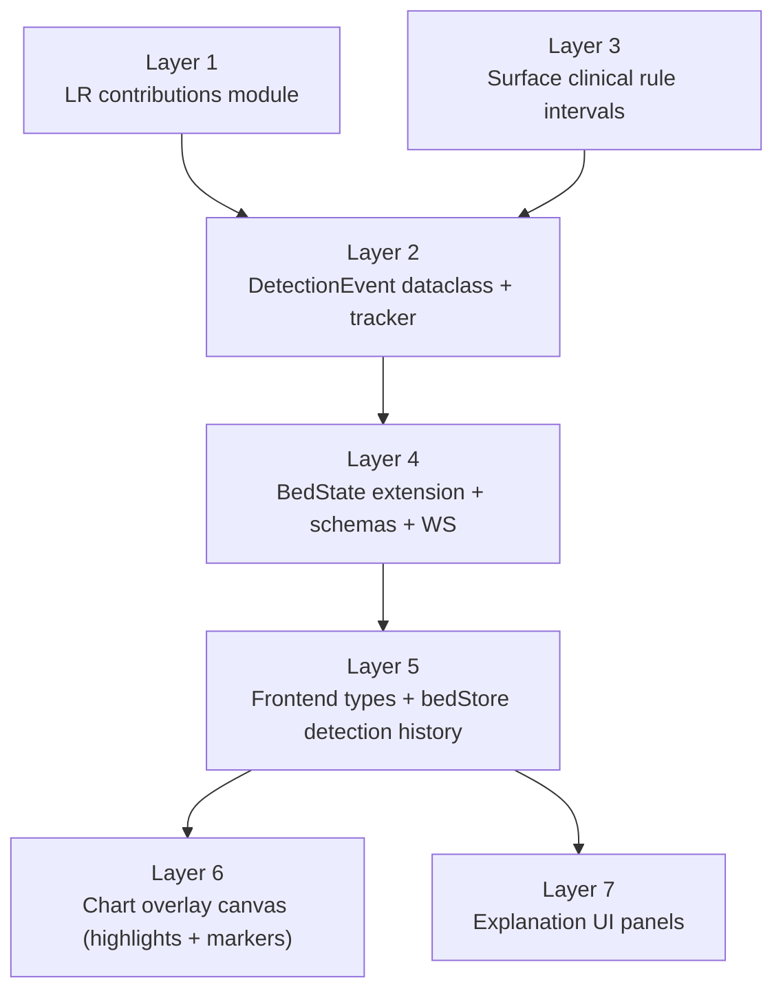

# Problems

## ISSUE-10 — מערך הסברתיות (Explainability) חסר

מסמך מימוש מלא לסוכן שיבנה את שכבת ההסברתיות. אין דוגמאות קוד — הסבר מילולי בלבד של מה לעשות, איפה, ולמה. כל הקבצים נתיבים יחסיים ל-`C:\Users\ariel\SentinelFetal2-Production\`.

### תיאור הבעיה

- המודל מפיק `risk_score` סופי בלבד, ללא חשיפה של "למה". `lr.coef_` ו-`lr.intercept_` נטענים אבל **לא נעשה בהם שימוש** בשום שלב — אין חישוב תרומות.
- כשהאלרט נדלק (`risk_score > decision_threshold = 0.4605` מ-`artifacts/production_config.json`) אין לכידת snapshot של ה-features שהובילו לערך. `AlertHistoryStore.record()` (`api/services/alert_history.py`) שומר רק `(timestamp, risk_score, alert_on, elapsed_s)`.
- הגרף לא מסמן בכלל את האזור שבו זוהתה הבעיה. `useCTGChart` (`frontend/src/hooks/useCTGChart.ts`) יודע לרנדר `setMarkers` עבור `active_events`, אבל זה משמש רק את God Mode — לא קיים מסלול מקביל לזיהויים של המודל.
- ברגע ש-`active_events` מתרוקן (`bedStore.ts: applyUpdate` מציב `activeEvents: u.active_events` בלבד), המרקרים נמחקים — אין שום שימור היסטורי של אירועים בצד הלקוח.
- כללים קליניים (`src/rules/decelerations.py`, `sinusoidal.py`, וכו') מחשבים פנימית את ה-`start/end samples` של כל deceleration כדי שיוכלו לספור אותם, אבל מחזירים החוצה רק ספירה מצטברת (`n_late_decelerations`) — מידע המיקום אובד.
- `FindingsPanel.tsx` (`frontend/src/components/detail/FindingsPanel.tsx`) מציג ערכי features גולמיים, ללא אינדיקציה אילו מהם תורמים כרגע לציון הסיכון.
- lightweight-charts v4.1 (`frontend/package.json`) לא מציעה shaded regions נטיביים — נדרשת תוספת overlay או series primitive.

### החלטות עיצוב (אושרו עם המשתמש)

1. **Granularity**: כל סוג זיהוי הוא event נפרד עם start/end ועם marker משלו על הגרף. **9 סוגים**: `lr_high_risk`, `late_deceleration`, `variable_deceleration`, `prolonged_deceleration`, `bradycardia`, `tachycardia`, `low_variability`, `sinusoidal`, `tachysystole`. אירוע קליני יכול להופיע גם אם ה-LR לא חצה את ה-threshold.
2. **Persistence**: כל האירועים שזוהו מאז פתיחת הדף נשמרים בלקוח (cap של 256 לכל מיטה כדי להגן על memory). ניקוי רק ב-page refresh. אין persistence ב-server (אופציונלי לעתיד).
3. **טכנולוגיית ה-highlight**: **overlay canvas** מעל ה-chart container (אותו רעיון כמו `Sparkline.tsx`) — שליטה מלאה ב-B&W palette, ניתוק מ-internal API של lightweight-charts. אופציה חלופית (Series Primitives של v4.1) — לא מומלצת בגלל מורכבות.
4. **B&W palette**: כל ה-highlighting עושה שימוש ב-opacity / stroke patterns / עובי קווים, ללא צבע.

### ארכיטקטורת הפתרון

7 רבדים בלתי-תלויים — מומלץ לממש ולעשות commit לכל רובד בנפרד.

**סטטוס מימוש נוכחי**:

- **רובד 1 — בוצע**: נוסף `src/inference/explainability.py` עם `FeatureContribution`,
  `FRIENDLY_LABELS` לכל 25 ה-features, `compute_top_contributions`, ו-sanity check
  ל-logit. `SentinelRealtime` טוען `feature_names` מהקונפיג ומחשב `top_contributions`
  בכל inference tick.
- **רובד 2 — בוצע**: נוסף `src/inference/detection_tracker.py` עם `DetectionEvent`
  ו-`DetectionTracker`. ה-tracker מזהה rising/falling edges עבור `lr_high_risk`,
  `bradycardia`, `tachycardia`, `low_variability`, `sinusoidal`, `tachysystole`,
  ומייצר דלתאות דרך `flush_pending`.
- **רובד 3 — בוצע**: `src/rules/decelerations.py` מחזיר עכשיו גם `intervals`
  אבסולוטיים לכל deceleration. `src/features/clinical_extractor.py` נשאר תואם לאחור
  עם `extract_clinical_features`, ונוספה `extract_clinical_features_with_intervals`.
  `src/inference/pipeline.py` מעביר את ה-intervals ל-`DetectionTracker`.
- **רובד 4 — בוצע**: `api/models/schemas.py` כולל עכשיו `FeatureContributionSchema`,
  `DetectionEventSchema`, ושדות `top_contributions`/`detection_events` ב-`BedUpdate`
  וב-`BedSnapshot`. `AlertEventSchema` הורחב עם `top_contributions`.
  `api/services/alert_history.py` שומר top contributions ב-alert ON, ו-`api/routers/beds.py`
  מחזיר אותם ב-`GET /api/beds/{bed_id}/alerts`.
- **רובד 5 — בוצע**: `frontend/src/types/index.ts` כולל עכשיו `FeatureContribution`
  ו-`DetectionEvent`, ו-`BedUpdate`/`AlertEventSchema` כוללים `top_contributions`.
  `frontend/src/stores/bedStore.ts` מחזיק `topContributions` חי לכל מיטה ו-`detectionHistory`
  מצטבר לסשן (merge לפי `event_id`, cap של 256 אירועים, ושמירת reference כשאין דלתאות).
- **רובד 6 — בוצע**: נוסף `frontend/src/components/detail/ChartOverlay.tsx`, חובר
  ל-`CTGChart`, ו-`useCTGChart` מציג markers persistent גם מ-`detectionHistory`
  וגם מ-God Mode. ה-overlay מצייר אזורים B&W לפי משפחות אירועים.
- **רובד 7 — בוצע**: נוספו `ExplanationPanel.tsx` ו-`DetectionList.tsx`.
  `DetailView`, `RiskGauge`, `FindingsPanel`, ו-`BedCard` מציגים עכשיו סיבה עיקרית,
  רשימת אירועים, הדגשת findings, וסיבת אירוע פעילה בכרטיס ward.



---

### רובד 1 — Backend: חישוב תרומות LR

**מטרה**: לחשוף איזה feature תרם כמה לציון הסיכון הנוכחי בכל inference tick.

**קובץ חדש**: `src/inference/explainability.py`

מה צריך לעשות:

- להגדיר dataclass `FeatureContribution` עם השדות: `name` (technical, identical ל-`feature_names` ב-`production_config.json`), `friendly_label` (str דו-לשוני HE/EN), `raw_value` (float — מה-`x` המקורי לפני scaling), `scaled_value` (float — אחרי `scaler.transform`), `coefficient` (float — מ-`lr.coef_[0]`), `contribution` (float — `scaled_value * coefficient`), `direction` (str — `"increases_risk"` אם `contribution > 0`, אחרת `"decreases_risk"`).
- פונקציה אחת מרכזית: `compute_top_contributions(x_raw, x_scaled, lr, feature_names, top_k=5) -> list[FeatureContribution]`. הפלט ממוין יורד לפי `abs(contribution)`.
- קבוע `FRIENDLY_LABELS: dict[str, dict[str, str]]` — מיפוי לכל 25 ה-features ל-`{"he": "...", "en": "..."}`. הוא חי במודול הזה, לא בקונפיג, כדי לאפשר עריכה קלה. דוגמאות: `n_late_decelerations` → `{"he": "האטות מאוחרות", "en": "Late decelerations"}`, `variability_amplitude_bpm` → `{"he": "אמפליטודת שונות", "en": "Variability amplitude"}`. **דרושים כל 25 השמות**, גם אלו שבוטים (`is_tachycardia`, `is_bradycardia`).
- `compute_top_contributions` חוזר את ה-friendly_label בעברית בלבד (HE-first); אם רוצים ENG בעתיד — להוסיף param.
- אסור לעדכן את `lr` או `scaler` — קריאה בלבד של `lr.coef_[0]` (vector של 25) ו-`lr.intercept_[0]` (scalar).
- בקובץ נפרד או באותו קובץ: פונקציית sanity-check (לא נקראת ב-runtime) — `assert_logit_consistency(x_scaled, lr)` שמוודא ש-`np.dot(x_scaled[0], lr.coef_[0]) + lr.intercept_[0]` תואם ל-`logit(lr.predict_proba(x_scaled)[0,1])` בטולרנס 1e-6. שימושי לבדיקה ידנית.

**אינטגרציה ב-`src/inference/pipeline.py`**:

- ב-`__init__` של `SentinelRealtime`: לטעון `feature_names` פעם אחת מהקונפיג ולשמור כ-attribute (`self._feature_names`). אם הקונפיג כבר נטען, לקחת משם.
- ב-`_compute_full_state`, מיד אחרי החישוב הקיים `risk = float(self._lr.predict_proba(x_scaled)[0, 1])` (סביב שורה 447): לקרוא `top_contributions = compute_top_contributions(x[0], x_scaled[0], self._lr, self._feature_names, top_k=5)`.
- שמור את התוצאה ב-`BedState.top_contributions` (השדה יוסף ברובד 4).
- ב-warmup או אם `lr` מחזיר NaN (סטטיסטית בלתי-סביר אבל אפשרי) — להחזיר רשימה ריקה.

---

### רובד 2 — Backend: DetectionEvent + state-machine tracker

**מטרה**: זיהוי קצוות (rising/falling edges) של כל סוג בעיה והפקת אירועים מובנים עם start/end. זהו ה-engine של מערך ההסברתיות.

**קובץ חדש**: `src/inference/detection_tracker.py`

**`DetectionEvent` dataclass**:

- `event_id: str` — `uuid4().hex`.
- `bed_id: str`.
- `source: str` — אחד מ-`"model"` או `"rule"`. `lr_high_risk` → `"model"`. כל השאר → `"rule"`.
- `event_type: str` — אחד מ-9 הסוגים מ-"החלטות עיצוב §1".
- `start_sample: int`.
- `end_sample: int | None` — `None` כל עוד פעיל.
- `still_ongoing: bool`.
- `peak_risk_score: float` — המקסימום שנצפה במהלך האירוע.
- `peak_sample: int` — sample שבו נצפה ה-peak.
- `top_contributions: list[FeatureContribution]` — רק עבור `source="model"`. Snapshot ברגע ה-rising edge וברגע ה-peak מתעדכן.
- `description: str` — טקסט קליני קצר בעברית (לדוגמה: `"סיכון גבוה (LR=0.62)"`, `"האטה מאוחרת בעומק 25 BPM"`).
- `timeline_summary: str` — `"Started 00:14:32 | Duration: 00:02:18"` (פורמט זהה ל-EventAnnotation של God Mode למניעת בלבול).
- `metadata: dict` — שדה גמיש: למשל `{"depth_bpm": 25}` ל-deceleration, `{"baseline_bpm": 102}` ל-bradycardia.

**`DetectionTracker` per-bed**:

יוצרים instance אחד לכל מיטה ושומרים אותו כ-attribute של `SentinelRealtime`.

מצב פנימי:
- `_active: dict[str, DetectionEvent]` — מפתח = `event_type`, ערך = האירוע הפעיל כרגע מאותו סוג. בלי כפילויות בו-זמנית מאותו סוג עבור flags (יש flag → יש אירוע אחד).
- `_seen_deceleration_keys: set[tuple[str, int]]` — `(event_type, start_sample)` של decelerations שכבר נראו. מונע double-emit כשחלונות חופפים.
- `_pending: list[DetectionEvent]` — תור פלט: כל אירוע שנפתח / עודכן / נסגר מאז הקריאה הקודמת ל-`flush_pending`.

מתודות:

1. `update(state, x_raw, top_contributions, clinical_intervals)`:
   - קלט: `BedState` חדש שכרגע התחשב, `x_raw` (vector 25-D לפני scaling), `top_contributions` מ-רובד 1, ו-`clinical_intervals` (רשימת intervals מרובד 3 — בינתיים תניחו ריקה).
   - לולאה על 6 ה-flag-events: `lr_high_risk`, `bradycardia`, `tachycardia`, `low_variability`, `sinusoidal`, `tachysystole`. עבור כל אחד:
     - חשבו את ה-condition הנוכחי (טבלה מתחת).
     - אם `condition=True` ולא היה אירוע פעיל — rising edge: `_create_event(event_type, source, sample, description, peak_risk_score, top_contributions)`, מוסיפים ל-`_active` ול-`_pending`.
     - אם `condition=False` והיה אירוע פעיל — falling edge: `_close_event(event_type, sample)` (כותב `end_sample`, `still_ongoing=False`, מסיר מ-`_active`, מוסיף ל-`_pending` שוב כדי שהלקוח יקבל את העדכון).
     - אם המצב נשמר (`condition=True` ופעיל) — `_update_peak(event_type, state.risk_score, state.sample_count, top_contributions)`. אם `risk_score > peak_risk_score` הקיים: עדכון; דחיפה ל-`_pending` רק אם הציון השתנה משמעותית (delta > 0.05) או `top_contributions` הראשונה השתנתה — מניעת spam.
   - לולאה על `clinical_intervals` (decelerations punctual): כל interval שלא ב-`_seen_deceleration_keys` → יצירת אירוע חדש עם `start_sample` ו-`end_sample` כבר ידועים, `still_ongoing=False`, `description` מותאם (`"האטה מסוג X בעומק Y BPM"`), הוספה ל-`_pending` ול-`_seen_deceleration_keys`.
2. `flush_pending() -> list[DetectionEvent]`: מחזיר את `_pending` ומאפס. הקוד הקורא משלב לתוך `BedState.detection_events`.
3. `reset()`: מאפס את `_active`, `_seen_deceleration_keys`, `_pending`. נקרא מ-`SentinelRealtime.reset()`.

טבלת condition לכל flag-event (חישוב מ-`BedState` בלבד, אין logic נוסף):

| event_type | condition | description (template) |
|---|---|---|
| `lr_high_risk` | `state.risk_score > state.alert_threshold` | `"סיכון גבוה (LR={risk:.2f})"` |
| `bradycardia` | `state.is_bradycardia > 0.5` | `"ברדיקרדיה (baseline={baseline:.0f} BPM)"` |
| `tachycardia` | `state.is_tachycardia > 0.5` | `"טכיקרדיה (baseline={baseline:.0f} BPM)"` |
| `low_variability` | `state.variability_category <= 1.0` | `"שונות נמוכה (קטגוריה {cat})"` |
| `sinusoidal` | `state.sinusoidal_detected` | `"דפוס סינוסואידלי"` |
| `tachysystole` | `state.tachysystole_detected` | `"טכיסיסטולה"` |

**אינטגרציה ב-`src/inference/pipeline.py`**:

- ב-`__init__`: `self._tracker = DetectionTracker(bed_id)`.
- בסוף `_compute_full_state`, אחרי שחושבו `risk_score`, `top_contributions`, וה-`BedState` הבסיסי הוכן: לקרוא `self._tracker.update(state, x_raw=x[0], top_contributions=top_contributions, clinical_intervals=clinical_intervals)`. אז `events_delta = self._tracker.flush_pending()` ו-`state.detection_events = events_delta`.
- חשוב: `state.detection_events` הוא **רשימת דלתאות** — לא state מלא. הלקוח ידע למזג בעצמו לפי `event_id`.
- `reset()` של `SentinelRealtime` חייב לקרוא `self._tracker.reset()`.

---

### רובד 3 — Backend: חשיפת אינטרוולים מהכללים הקליניים

**מטרה**: היום `extract_clinical_features` מחזיר רק ספירות (`n_late_decelerations` וכו'). נדרש לחשוף גם רשימת ה-decelerations הבודדים עם start/end.

**קבצים מעורבים**:

- `src/rules/decelerations.py` — לקרוא לעומק את הפונקציות הציבוריות. הכלל מזהה decelerations בודדים פנימית (אחרת אי-אפשר היה לספור). השינוי: לחשוף גם list[dict] במבנה `{"event_type": "late_deceleration"|"variable_deceleration"|"prolonged_deceleration", "start_sample": int, "end_sample": int, "depth_bpm": float}`. אסור לשבור signature קיים — להוסיף return tuple עם field נוסף או לחזור dict מורחב.
- `src/features/clinical_extractor.py` — `extract_clinical_features` היום מחזיר `dict[str, float]` של 11 features. נדרש להחזיר tuple `(features_dict, intervals_list)` או dict חדש `{"features": ..., "intervals": ...}`. **בחר את החלופה השנייה** כדי שהחתימה תהיה future-proof.
- `src/inference/pipeline.py` — לעדכן את הקריאה לקבל את ה-intervals ולהעביר אותם ל-`DetectionTracker.update`.

מה לעשות:

- ב-`decelerations.py`: לזהות את הפונקציה שמחשבת את ה-counts (סביר שנקראת `detect_decelerations` או דומה). לוודא שהיא מסוגלת להחזיר גם רשימה של intervals יחד עם ה-counts. בשלב הזה — אם הפונקציה לא מחזיקה במידע המדויק על start/end (לדוגמה רק סופרת אירועים בלי לזכור איפה), יש להוסיף שמירה של start/end לכל deceleration שזוהה. זה יתבצע פנימית בכלל ולא ישנה את הקוד שכבר עושה שימוש בו.
- שני הפרמטרים החשובים: `start_sample` ו-`end_sample` חייבים להיות **absolute** (יחסיים לתחילת ההקלטה), לא relative ל-window. ה-pipeline שולח לחלל הכלל את `_fhr_ring` בגודל 1800 שמתחיל ב-`window_start = sample_count - 1800`. הכלל מקבל את ה-window_start כפרמטר נוסף ומחשב `start_sample_absolute = window_start + relative_start`. לחלופין: הכלל יחזיר relative וה-pipeline יוסיף את ה-offset לפני שהוא מעביר ל-tracker.
- ב-`extract_clinical_features` (`clinical_extractor.py`): לאסוף את ה-intervals מהכללים השונים (decelerations הם הקריטיים; אם sinusoidal/tachysystole מחשבים אינטרוול — לכלול גם אותם, אך הם פחות מהותיים כי הם flags ולכן מטופלים ב-rising/falling ב-tracker בכל מקרה).
- ב-`pipeline.py`: שינוי הקריאה ל-`extract_clinical_features` כדי לקבל גם intervals; העברה ל-`tracker.update`.

**אזהרה**: השינוי ב-API של הכללים יפגע ב-tests קיימים. רוץ `pytest tests/` (ובמיוחד `tests/test_rules.py`, `tests/test_clinical_extractor.py` אם קיימים) ואחר כך תקן. אם אין tests — להוסיף test בסיסי שמוודא שהאינטרוולים מוחזרים נכונים.

---

### רובד 4 — Backend: BedState/Schemas/WebSocket/AlertHistory

**מטרה**: להוביל את `top_contributions` ו-`detection_events` ל-WebSocket ו-REST.

**סטטוס: בוצע.**

מה נכנס בפועל:

- `BedState` כבר הורחב ברבדים 1–3 עם `top_contributions` ו-`detection_events`.
- `api/models/schemas.py` קיבל `FeatureContributionSchema` ו-`DetectionEventSchema`.
- `BedUpdate` ו-`BedSnapshot` קיבלו `top_contributions` ו-`detection_events`, כך שגם WebSocket
  (`batch_update`/`initial_state`) וגם REST snapshots יודעים לתאר את השדות החדשים.
- `AlertEventSchema` קיבל `top_contributions` עם ברירת מחדל ריקה לתאימות לאחור.
- `api/services/alert_history.py` שומר snapshot של `state.top_contributions[:5]` רק ב-transition
  של `alert_on=True`. ב-transition של כיבוי alert נשמרת רשימה ריקה.
- טעינת `data/alert_log.jsonl` נשארה תואמת לאחור: אם שורות ישנות חסרות `top_contributions`,
  הן נטענות עם `[]`.
- `api/routers/beds.py` מחזיר את `top_contributions` ב-`GET /api/beds/{bed_id}/alerts`.
- לא נוסף endpoint נפרד ל-`detection-history` בשלב זה, כי לפי התכנית הוא אופציונלי והרבדים
  5–7 אמורים לצבור היסטוריה בצד הלקוח מתוך `detection_events` הדלתאיים.

**קבצים מעורבים**:

- `src/inference/pipeline.py` — `BedState` dataclass.
- `api/models/schemas.py` — `BedUpdate` (Pydantic).
- `api/services/alert_history.py` — `AlertEvent` dataclass.
- `api/services/broadcaster.py` — לוודא ש-`dataclasses.asdict` מעביר את השדות החדשים.

**שדות חדשים ב-`BedState`** (ב-`pipeline.py`):

- `top_contributions: list[FeatureContribution] = field(default_factory=list)` — תמיד מוצב, ריק רק לפני warmup.
- `detection_events: list[DetectionEvent] = field(default_factory=list)` — דלתאות מ-`flush_pending`.

**סכמות חדשות ב-`api/models/schemas.py`**:

- `FeatureContributionSchema(BaseModel)` — `name: str`, `friendly_label: str`, `raw_value: float`, `contribution: float`, `direction: Literal["increases_risk", "decreases_risk"]`. שדות שאינם קריטיים ל-UI (`scaled_value`, `coefficient`) **לא** נשלחים — דחיסה.
- `DetectionEventSchema(BaseModel)` — מקביל ל-dataclass של רובד 2: `event_id`, `bed_id`, `source`, `event_type`, `start_sample`, `end_sample`, `still_ongoing`, `peak_risk_score`, `peak_sample`, `top_contributions: list[FeatureContributionSchema]`, `description`, `timeline_summary`, `metadata: dict`.
- ב-`BedUpdate` — שני שדות חדשים:
  - `top_contributions: list[FeatureContributionSchema] = Field(default_factory=list)`
  - `detection_events: list[DetectionEventSchema] = Field(default_factory=list)`
- ב-`AlertEventSchema` (קיים) — שדה חדש: `top_contributions: list[FeatureContributionSchema] = Field(default_factory=list)`. ברירת מחדל ריקה למניעת שבירת תאימות.

**הרחבת `AlertHistoryStore`**:

- `AlertEvent` dataclass: שדה חדש `top_contributions: list[dict] = field(default_factory=list)` (serialized). בכתיבה ל-`alert_log.jsonl` — לוודא שמסתבך עם `dataclasses.asdict` או `json.dumps(default=...)`.
- ב-`record(state)`: כשהאלרט קופץ False → True (`alert_on=True`), לבצע `top_contributions=[asdict(c) for c in state.top_contributions[:5]]` ולשמור ב-`AlertEvent`. ב-False (alert_off): רשימה ריקה.
- אחורית — `data/alert_log.jsonl` הקיים: שורות ישנות בלי `top_contributions` יישארו תקפות. בקריאה (`load`), אם השדה חסר → `[]`.

**REST endpoint חדש** (אופציונלי לרובד הזה — מומלץ אבל לא חובה):

- `GET /api/beds/{bed_id}/detection-history?limit=N` — מחזיר את כל אירועי ה-detection מאז תחילת ה-pipeline למיטה.
- מקור הנתונים: store חדש בשם `DetectionHistoryStore` (in-memory ב-`api/services/detection_history.py`) או חשיפה של `tracker._all_events` כ-property (פחות נקי).
- אם הסוכן רוצה להישאר minimal: לדלג על ה-endpoint ולהסתפק בכך שהלקוח מצטבר בעצמו (החלטה תקפה — לפי החלטה 2 של עיצוב הלקוח מצטבר ממילא).

**`AsyncBroadcaster.push()`** (`api/services/broadcaster.py`):

- כבר משתמש ב-`dataclasses.asdict(state)` לסידור — `FeatureContribution` ו-`DetectionEvent` הם dataclasses רגילים ויעבדו אוטומטית. **לוודא** שאין enums או טיפוסים מורכבים אחרים ב-dataclasses (אם יש — להמיר ל-str).

---

### רובד 5 — Frontend: types + bedStore detection history

**מטרה**: לאחסן בלקוח את כל אירועי ה-detection לאורך הסשן ולחשוף אותם לקומפוננטות.

**סטטוס: בוצע.**

מה נכנס בפועל:

- `frontend/src/types/index.ts` קיבל `FeatureContribution` ו-`DetectionEvent`.
- `BedUpdate` קיבל `top_contributions` ו-`detection_events`.
- `AlertEventSchema` קיבל `top_contributions`, כדי שה-frontend יהיה מסונכרן עם REST alerts.
- `frontend/src/stores/bedStore.ts` קיבל שני שדות חדשים ב-`BedData`:
  - `topContributions` — snapshot חי של התרומות האחרונות מהשרת.
  - `detectionHistory` — היסטוריית events מצטברת בצד הלקוח.
- `detectionHistory` מתמזג לפי `event_id`: אירוע חדש נוסף, אירוע קיים מתעדכן.
- נשמר cap של `256` אירועים לכל מיטה (`DETECTION_HISTORY_LIMIT`) כדי למנוע גדילת memory לא מבוקרת.
- אם update מגיע בלי `detection_events`, נשמר אותו reference של `detectionHistory` כדי לא לייצר rerenders מיותרים.
- אם `top_contributions` לא השתנו לפי `name + contribution`, נשמר אותו reference כדי לצמצם rerenders.
- `useBedStream.ts` לא שונה — `bedStore.updateFromWebSocket` מטפל בשדות החדשים דרך `applyUpdate`.

**קבצים מעורבים**:

- `frontend/src/types/index.ts`
- `frontend/src/stores/bedStore.ts`
- `frontend/src/hooks/useBedStream.ts` (שינוי מינורי או ללא שינוי)

**הוספת interfaces ל-`types/index.ts`** — מקביל למיקום של `EventAnnotation` הקיים:

- `FeatureContribution`: `name: string`, `friendly_label: string`, `raw_value: number`, `contribution: number`, `direction: 'increases_risk' | 'decreases_risk'`.
- `DetectionEvent`: כל השדות המקבילים ל-`DetectionEventSchema` ב-backend. בפרט `top_contributions: FeatureContribution[]`, `metadata: Record<string, unknown>`.
- עדכון `BedUpdate`: הוספת `top_contributions: FeatureContribution[]` ו-`detection_events: DetectionEvent[]`. ברירות מחדל בקריאה: `??[]` בכל מקום.

**הרחבת `BedData` ב-`bedStore.ts`**:

- שדה חדש `topContributions: FeatureContribution[]` — נדרס בכל update (snapshot חי, לא היסטוריה).
- שדה חדש `detectionHistory: DetectionEvent[]` — מצטבר. הלוגיקה ב-`applyUpdate`:
  1. לכל event ב-`u.detection_events` (זו דלתא): חיפוש לפי `event_id` ב-`detectionHistory` הקיים.
  2. אם לא קיים → דחיפה לסוף.
  3. אם קיים → עדכון השדות (`end_sample`, `still_ongoing`, `peak_risk_score`, `peak_sample`, `top_contributions`, `description`, `timeline_summary`, `metadata`). שמירה על `event_id`, `start_sample`, `source`, `event_type`, `bed_id`.
  4. אם מספר האירועים > 256 → הסרה של הישן ביותר (FIFO לפי `start_sample`).
- `detectionHistory` הוא **plain array**, לא RingBuffer — גודל קטן וצריך עדכון by-id. עדכון יוצר array חדש (immutable) כדי ש-Zustand יזהה שינוי.

**אופטימיזציית renderים**:

- ב-`updateFromWebSocket`, השוואת referential equality על `detectionHistory`: אם אין דלתאות חדשות (`u.detection_events.length === 0`), שמור אותו reference מהקודם. זה מונע re-renders מיותרים של DetectionList בכל tick של 6 שניות.
- שדה חדש `topContributions`: שמור reference קודם אם הראשון לא השתנה (השוואה רדודה על `name + contribution`).

`useBedStream.ts` — לא צריך שינוי. `bedStore.updateFromWebSocket` כבר עושה הכול.

---

### רובד 6 — Frontend: Chart overlay canvas (highlights + persistent markers)

**מטרה**: על-גבי ה-CTGChart, לצייר אזורים מודגשים לכל אירוע ב-`detectionHistory`, ולשמור את המרקרים גם אחרי שהאירוע נגמר.

**סטטוס: בוצע.**

מה נכנס בפועל:

- נוסף `frontend/src/components/detail/ChartOverlay.tsx` — canvas overlay מעל ה-chart.
- `CTGChart.tsx` פוצל ל-wrapper יחסי + div פנימי של lightweight-charts + overlay canvas.
- `useCTGChart.ts` מחזיר עכשיו `chartApi` ומקבל `detectionHistory`.
- ה-markers של `useCTGChart` מאוחדים משני מקורות:
  - `activeEvents` של God Mode.
  - `detectionHistory` של explainability.
- לכל `DetectionEvent` מוצג marker התחלה, marker סיום, ול-`lr_high_risk` גם marker peak.
- ה-overlay מצייר אזורים persistent לפי משפחות אירועים:
  - `lr_high_risk` — מילוי אפור + stroke חזק.
  - deceleration family — מילוי אפור חלש + hatching.
  - slow-state family — מילוי אפור חלש + dotted vertical lines.
- `ChartOverlay` מאזין ל-`timeScale().subscribeVisibleTimeRangeChange` ול-resize כדי לצייר מחדש ב-pan/zoom/resize.
- ה-overlay הוא `pointerEvents: none`, ולכן אינטראקציות chart נשארות פעילות.

**קבצים מעורבים**:

- `frontend/src/components/detail/CTGChart.tsx` — שינוי קל (להוסיף overlay child).
- `frontend/src/hooks/useCTGChart.ts` — לעדכן את ה-effect של ה-markers שיקרא מ-`detectionHistory` (ועדיין ידרוס/יוסיף את `activeEvents` של God Mode בנפרד).
- **קובץ חדש**: `frontend/src/components/detail/ChartOverlay.tsx`.

**`ChartOverlay.tsx` — חדש**:

- Props: `events: DetectionEvent[]`, `chartApi: IChartApi | null`, `containerRef: React.RefObject<HTMLDivElement>`.
- מציב `<canvas ref={canvasRef}>` עם `position: absolute`, `inset: 0`, `pointerEvents: none` מעל ה-chart container (ה-CTGChart מחזיר div שמכיל את ה-chart + את ה-overlay).
- בתוך `useEffect` שמאזין ל-`events` ול-`chartApi`:
  1. Listener ל-`chartApi.timeScale().subscribeVisibleTimeRangeChange(redraw)` ול-resize observer על ה-container — בכל שינוי, redraw.
  2. ב-redraw:
     - מנקה את ה-canvas.
     - עבור כל `event` ב-`events`: חישוב `xStart = chartApi.timeScale().timeToCoordinate(event.start_sample / 4.0 as Time)`. אם `null` (מחוץ לתחום הנראה) — דלג. אם `event.still_ongoing` או `event.end_sample === null` → `xEnd = chartApi.timeScale().timeToCoordinate(currentTime as Time) ?? canvas.width`. אחרת `xEnd = chartApi.timeScale().timeToCoordinate(event.end_sample / 4.0 as Time)`.
     - ציור rectangle בין `xStart` ו-`xEnd`, מ-y=0 עד y=canvas.height.
     - סגנון לפי `event_type` (3 סגנונות בלבד לגרסה הראשונה):
       - **High-risk family** (`lr_high_risk`): `fillStyle = 'rgba(0,0,0,0.10)'`, plus stroke בקו רציף בקצוות (`strokeStyle = 'rgba(0,0,0,0.45)'`, `lineWidth = 2`).
       - **Deceleration family** (`late_deceleration`, `variable_deceleration`, `prolonged_deceleration`): `fillStyle = 'rgba(0,0,0,0.06)'`, וקו אלכסוני-hatching דליל (פונקציית עזר `drawHatching(ctx, x1,y1,x2,y2, spacing=8)`).
       - **Slow-state family** (`bradycardia`, `tachycardia`, `low_variability`, `sinusoidal`, `tachysystole`): `fillStyle = 'rgba(0,0,0,0.05)'`, dotted vertical lines spaced 6px.
     - עבור אירועים `still_ongoing=true`: מעטפת stroke מקווקווצת (dashed, `lineWidth=1`) ב-edge הימני כדי לציין "ongoing".
     - לא מצייר tav-tick עבור אירועים שכולם מחוץ לתחום הנראה.
     - מעל כל אזור — תווית קצרה (`event.description.slice(0, 30)`) ב-top-left של האזור (`y=12`, fontSize=10, color שחור), אם רוחב האזור ≥ 60px. אחרת מסתפקים בלי תווית, רק חץ ב-marker (ראה useCTGChart).
  3. ResizeObserver: בעת resize של ה-container → עדכון `canvas.width`/`canvas.height` ו-redraw.
- חשוב: ה-overlay לא תופס clicks (`pointerEvents: none`) — chart ממשיך לעבוד מתחת.
- ה-canvas לא משתמש ב-RAF loop של Sparkline — redraw ייעודי ב-events או ב-zoom/pan/resize בלבד.

**`useCTGChart.ts` — שינוי `setMarkers`-effect**:

- חתימה: הוספת פרמטר `detectionHistory: DetectionEvent[]`. השאיר את `activeEvents` כמו שהוא לתאימות עם God Mode.
- בניית מערך markers משולב מ-**שתי** הרשימות:
  - מ-`activeEvents` (God Mode) — בדיוק כמו היום.
  - מ-`detectionHistory` — לכל event:
    - מרקר start: `time = start_sample / 4`, `position: 'belowBar'`, `shape: 'arrowDown'`, `text` = label של 4 תווים (מיפוי ב-CONST: `lr_high_risk`→`'RISK'`, `late_deceleration`→`'LATE'`, וכו').
    - אם `!still_ongoing && end_sample !== null`: מרקר end ב-`end_sample / 4`, `position: 'aboveBar'`, `shape: 'arrowUp'`, `text=''`.
    - אם `event_type === 'lr_high_risk'` ו-`peak_sample !== start_sample`: מרקר נוסף ב-peak: `position: 'inBar'`, `shape: 'circle'`, `text=''`.
- כל המרקרים נשארים על הגרף — **המקור של ה-persistence**: `detectionHistory` הוא רק גדל (FIFO ב-256).
- הוספת השוואה רדודה: אם `detectionHistory.length` לא השתנה ו-`activeEvents` לא השתנה → דילוג על `setMarkers`. שלא יחזור על אותם markers בכל tick.
- התלות של ה-effect: `[detectionHistory, activeEvents]`.

**`CTGChart.tsx` — שינוי**:

- חשיפת `chartApi` מ-`useCTGChart` כ-ref חיצוני (תוסיף param ל-hook או return value: `useCTGChart(...)` יחזיר `{chartApi}`).
- הוספת `<ChartOverlay events={detectionHistory} chartApi={chartApi} containerRef={containerRef} />` כ-child בתוך ה-div החיצוני, אחרי ה-div של ה-chart עצמו.
- props חדש ל-`CTGChart`: `detectionHistory: DetectionEvent[]`. ה-DetailView מעביר `bed.detectionHistory`.

---

### רובד 7 — Frontend: Explanation UI panels

**מטרה**: טקסט ברור של "מה זוהה בדיוק" — תרומות features חיות + רשימת אירועים + הדגשת findings פעילים.

**סטטוס: בוצע.**

מה נכנס בפועל:

- נוסף `frontend/src/components/detail/ExplanationPanel.tsx`: מציג top 5 feature contributions,
  ערך גולמי, כיוון תרומה, ו-bar שחור/אפור לפי עוצמה.
- נוסף `frontend/src/components/detail/DetectionList.tsx`: מציג את כל אירועי ה-session,
  עם badge קצר, תיאור, timeline summary, וסיבה עיקרית באירועי model.
- `RiskGauge.tsx` מציג עכשיו שורת `סיבה עיקרית` לפי `topContributions[0]`.
- `FindingsPanel.tsx` מקבל `topContributions` ומדגיש rows קליניים שמופיעים בטופ 5.
- `BedCard.tsx` מציג סיבה פעילה קצרה אם יש אירוע ongoing ב-`detectionHistory`.
- `DetailView.tsx` משלב את כל הפאנלים, מעביר `detectionHistory` ל-`CTGChart`,
  ושומר `chartApi` כדי ש-click על אירוע ב-`DetectionList` יעשה focus על אותו אזור בגרף.

**קבצים חדשים**:

- `frontend/src/components/detail/ExplanationPanel.tsx`
- `frontend/src/components/detail/DetectionList.tsx`

**קבצים שישתנו**:

- `frontend/src/components/detail/FindingsPanel.tsx`
- `frontend/src/components/detail/RiskGauge.tsx`
- `frontend/src/components/ward/BedCard.tsx`
- `frontend/src/components/detail/DetailView.tsx`

**`ExplanationPanel.tsx`**:

- Prop יחיד: `topContributions: FeatureContribution[]`.
- אם `topContributions.length === 0` או המיטה ב-warmup → "ממתין להתחממות..."
- אחרת: 5 שורות (top 5):
  - שורה: `friendly_label` בצד שמאל (HE), ערך גולמי בפורמט מתאים בצד ימין:
    - boolean (`is_tachycardia`, `is_bradycardia`, `sinusoidal_detected`, `tachysystole_detected`): `"כן"` או `"לא"`.
    - `variability_category`: `"מינימלית"|"מתונה"|"מסומנת"|"נעדרת"` (מיפוי).
    - אחרת: ספרה עשרונית עם פורמט הגיוני (BPM ללא עשרוני, אחוזים עם עשרוני).
  - אינדיקטור עוצמה: bar אופקי שגודלו פרופורציונלי ל-`abs(contribution)`. כל השורות נורמליות יחד לפי `max(abs(contribution))` של 5 התרומות.
  - חץ קטן: `↑` אם `direction === 'increases_risk'`, `↓` אם `decreases_risk`. **שחור-לבן בלבד**.
- כותרת הפאנל: `"גורמים מובילים לציון הסיכון"`.

**`DetectionList.tsx`**:

- Props: `events: DetectionEvent[]`, `onSelect?: (event: DetectionEvent) => void`.
- כותרת: `"אירועים שזוהו ({events.length})"`.
- מיון: חדשים קודם — `[...events].sort((a, b) => b.start_sample - a.start_sample)`.
- כל שורה (clickable):
  - Badge קצר עם 4-תווים (אותו מיפוי כמו useCTGChart): `RISK`, `LATE`, `VAR`, `PROL`, `BRAD`, `TACH`, `LOWV`, `SIN`, `TS`. סגנון: הפוך-צבע אם `still_ongoing`, רגיל אם נסגר.
  - `description`.
  - `timeline_summary`.
  - אם `top_contributions.length > 0` ו-`source === 'model'`: שורה משנית עם `friendly_label` של ה-top1 בלבד.
- click → `onSelect(event)`. ה-handler ב-`DetailView` יקרא ל-`chartApi.timeScale().setVisibleRange({ from: event.start_sample/4 - 60, to: (event.end_sample ?? event.start_sample)/4 + 60 })`.
- אם `events.length === 0`: `"לא זוהו אירועים מאז תחילת הסשן"`.

**`FindingsPanel.tsx` — שינוי**:

- Props חדש: `topContributions: FeatureContribution[]`.
- מחשב `Set<string>` של `name` של top 5.
- כל row מקבל אינדיקציה אם השם הטכני שלו מופיע ב-set: גבול שמאלי שחור עבה (3px) במקום הגבול הרגיל. כך מודגש ויזואלית "הערך הזה משפיע כרגע".
- מיפוי שמות הוא קריטי: כל row ב-FindingsPanel מתאים ל-feature אחד ב-25 (ראה `feature_names` בקונפיג). שמירה על dict מקומי ב-FindingsPanel: `ROW_TO_FEATURE_NAME: Record<string, string>`.

**`RiskGauge.tsx` — שינוי**:

- Prop חדש: `topContribution?: FeatureContribution`.
- אם קיים: שורה אחת מתחת לציון: `"סיבה עיקרית: {friendly_label}"`. גופן קטן, אפור.
- ה-DetailView מעביר `topContributions[0]`.

**`BedCard.tsx` — שינוי**:

- בדיקה: האם `bed.detectionHistory` כולל אירוע אחד או יותר עם `still_ongoing=true`?
- אם כן: שורה חדשה תחת ה-`recordingId` המציגה את `description` של האירוע הראשון מסוג `lr_high_risk` (עדיפות) או הראשון בכלל. אורך מקסימלי 40 תווים, ellipsis.
- אם `bed.topContributions[0]` קיים ואין אירועים פעילים: לא להציג כלום (`topContributions` חי גם בלי אלרטים).

**`DetailView.tsx` — שילוב**:

מבנה מוצע (פסאודו-JSX):
```
<DetailView>
  ...header...
  <RiskGauge ... topContribution={bed.topContributions[0]} />
  <GodModePanel />
  <CTGChart bedId detectionHistory={bed.detectionHistory} activeEvents baselineBpm />
  <div grid grid-cols-1 md:grid-cols-2 gap-4>
    <FindingsPanel bed topContributions={bed.topContributions} />
    <ExplanationPanel topContributions={bed.topContributions} />
  </div>
  <DetectionList events={bed.detectionHistory} onSelect={focusOnEvent} />
  <AlertHistory bedId />
  <EventJournal bedId pin />
</DetailView>
```

`focusOnEvent` הוא `useCallback` שמקבל ref ל-`chartApi` (חשיפה מ-`CTGChart` באמצעות ref forwarding או context קל).

---

### רשימת קבצים: חדשים / משתנים

**Backend חדשים**:

- `src/inference/explainability.py` (רובד 1)
- `src/inference/detection_tracker.py` (רובד 2)
- `api/services/detection_history.py` (רובד 4 — אופציונלי)

**Backend משתנים**:

- `src/inference/pipeline.py` (`__init__`, `_compute_full_state`, `reset`, `BedState` dataclass) — רבדים 1, 2, 3, 4
- `src/rules/decelerations.py` (חשיפת intervals) — רובד 3
- `src/features/clinical_extractor.py` (החזרת dict עם features+intervals) — רובד 3
- `api/models/schemas.py` (`BedUpdate`, `AlertEventSchema`, חדשים: `FeatureContributionSchema`, `DetectionEventSchema`) — רובד 4
- `api/services/alert_history.py` (`AlertEvent`, `record`) — רובד 4
- `api/routers/beds.py` או דומה (אם מוסיפים endpoint) — רובד 4

**Frontend חדשים**:

- `frontend/src/components/detail/ChartOverlay.tsx` (רובד 6)
- `frontend/src/components/detail/ExplanationPanel.tsx` (רובד 7)
- `frontend/src/components/detail/DetectionList.tsx` (רובד 7)

**Frontend משתנים**:

- `frontend/src/types/index.ts` — רובד 5
- `frontend/src/stores/bedStore.ts` — רובד 5
- `frontend/src/hooks/useCTGChart.ts` — רובד 6
- `frontend/src/components/detail/CTGChart.tsx` — רובד 6
- `frontend/src/components/detail/DetailView.tsx` — רובד 7
- `frontend/src/components/detail/FindingsPanel.tsx` — רובד 7
- `frontend/src/components/detail/RiskGauge.tsx` — רובד 7
- `frontend/src/components/ward/BedCard.tsx` — רובד 7

---

### בדיקות קבלה (acceptance criteria)

יש לאמת ידנית את כולן ב-Docker dev-stack לפני סגירת ה-issue:

1. **Rising edge ראשון של LR**: כשהמודל מזהה `risk > threshold` בפעם הראשונה לאחר warmup — חץ `▼` עם תווית `RISK` מופיע על הגרף; אזור בהיר-אפור מתחיל מהנקודה ההיא ב-overlay; שורה חדשה מופיעה ב-DetectionList; ExplanationPanel מציג 5 התרומות העיקריות.
2. **Falling edge**: כש-`risk < threshold` — חץ `▲` ב-falling edge; ה-overlay נסגר באותה נקודה; השורה ב-DetectionList מתעדכנת ל-`still_ongoing=false`. **המרקרים והאזור נשארים על הגרף**.
3. **Deceleration בודד**: כשהכלל מזהה late deceleration — חץ `▼` עם `LATE` במקום ה-start_sample, חץ `▲` ב-end_sample, אזור הצללה צר עם diagonal hatching, רשומה ב-DetectionList עם `"האטה מסוג late בעומק XX BPM"`.
4. **3 אירועים שונים אחרי 30 דקות**: כל השלושה נראים בו-זמנית על הגרף עם סגנונות overlay שונים (high-risk, deceleration, slow-state); click על אחד ב-DetectionList מזיז את ה-visible time range של הגרף לאזור.
5. **Page refresh**: DetectionList מתאפסת. אירועים שהיו `still_ongoing=true` יישלחו מחדש מ-`tracker._active` בקריאה הראשונה (ה-tracker צריך לזכור אותם!) ויופיעו מיידית; אירועים שכבר נסגרו לא יחזרו (אין persistence ב-server).
6. **AlertHistory REST**: `GET /api/beds/{id}/alert-history` מחזיר את כל ה-transitions עם `top_contributions` מצורפים לשורות `alert_on=true`.
7. **Type-check ו-tests**: `cd frontend && npm run typecheck` עובר נקי. `pytest tests/` עובר נקי (כולל ה-tests החדשים על הכללים).
8. **גודל הודעת WS**: `batch_update` ממוצעת לא גדלה ב-> 30% (כי `detection_events` הוא דלתאות, לא state מלא, ו-`top_contributions` הוא 5 שדות בלבד). למדוד עם DevTools Network panel ב-Detail view.
9. **B&W בלבד**: כל ה-overlay, badges, וההדגשות ב-ExplanationPanel/FindingsPanel הם שחור-לבן-אפור בלבד. אין צבעים.

---

### מה לא נכלל בכוונה (out of scope)

- שיטות הסבר non-linear (SHAP, LIME). LR לינארי לחלוטין → `coefficient × value` הוא ה-attribution המלא והנכון.
- Backend persistence של `detection_history` ל-disk. אם תידרש בהמשך — `DetectionHistoryStore` ב-SQLite או JSON-lines append-only.
- אינטגרציה עם `risk_delta` הקיים — נשאר כפי שהוא, מוצג ב-RiskGauge.
- שינוי בפלטה הויזואלית מעבר ל-B&W.

---

> **ISSUE-09 — גרפים לא חלקים (נפתר)**
>
> בוצע ב-5 רבדים (commits בסניף `refactor/uv-migration-pack-hardening`):
>
> - **רובד 1**: `default_replay_speed` הורד מ-10× ל-1×. `push_chart_tick` הועבר
>   מ-thread pool לevent loop — הגרף לא תלוי יותר בעומס ה-AI.
>   תור נפרד ל-ticks ב-`AsyncBroadcaster`.
> - **רובד 2**: פרוטוקול WebSocket הורחב: `ward_chart_ticks` (≤4 Hz, לכל הלקוחות)
>   + `chart_ticks` (קצב מלא, רק ללקוח עם focused bed). לקוחות שולחים
>   `{"type":"focus","bed_id":"..."}` בעת פתיחת DetailView.
> - **רובד 3**: כרטיסי ward עברו מ-`lightweight-charts` ל-`Sparkline.tsx` — canvas
>   גולמי עם RAF loop ו-dirty flag. 16 מיטות = 16 canvas פשוטים במקום 16 chart instances.
> - **רובד 4**: `useCTGChart` — `setData` ההיסטוריה נדחה לפריים הבא (shell מצטייר קודם).
>   live ticks מצטברים ב-buffer ומתרוקנים ב-RAF יחיד (max 1 repaint לפריים).
> - **רובד 5**: `chartUpdateBus` עבר ל-`RingBuffer` — push הוא O(1) ללא slice.
>   `initializeFromSnapshot` מזריע את ה-bus בנתוני ה-snapshot (24 דגימות לכל מיטה)
>   כדי ש-Sparklines ו-detail chart יתחילו עם הקשר מיידי אחרי רענון עמוד.
